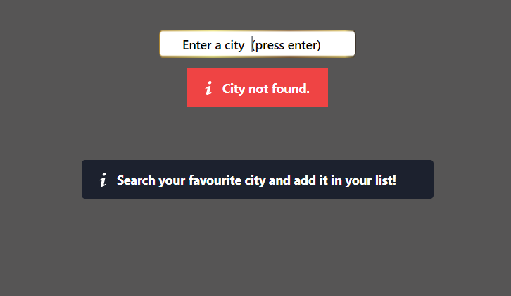
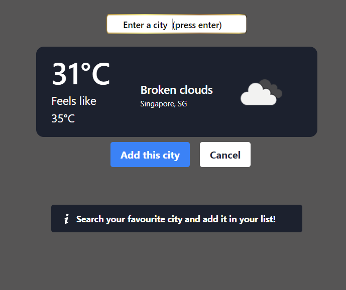
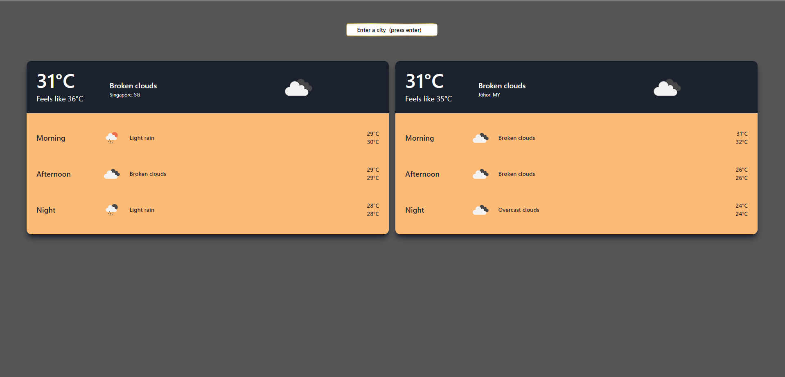
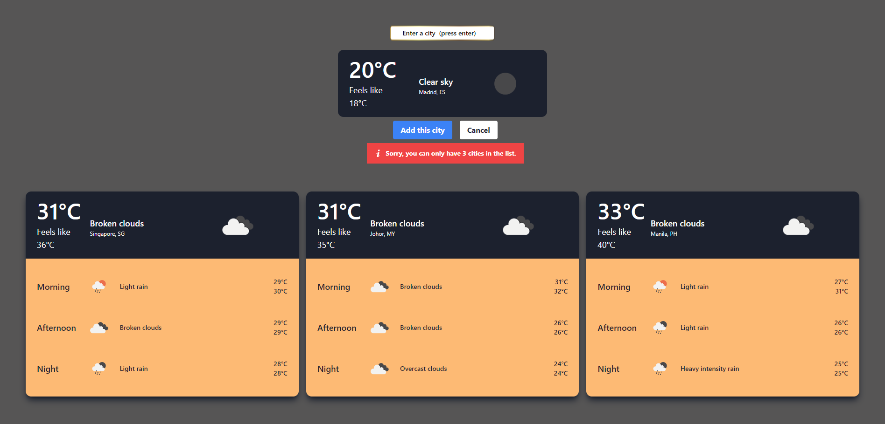
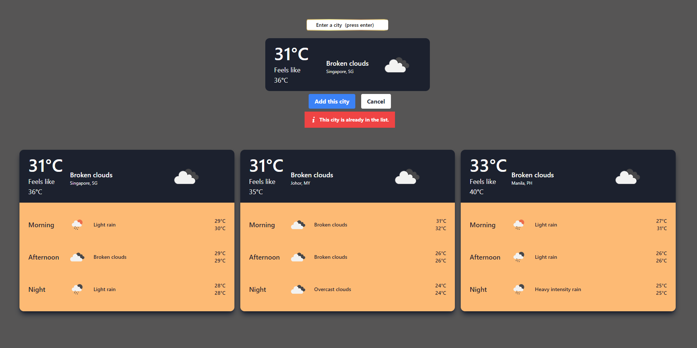
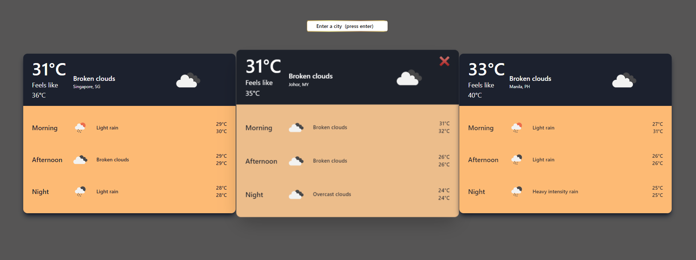

# Weather App

# Overview
This responsive weather web application was developed by using backend with PHP Laravel Framework and OpenWeatherMap API, front-end with Vue3 and Tailwind CSS. 

# Setup Process
- [ ] Pull the code in your machine.
- [ ] Run "composer install"
- [ ] Create a new file called ".env"
- [ ] Copy all the contents from .env.example to .env
- [ ] Run "php artisan key:generate"
- [ ] Run "php artisan storage:link"
- [ ] Run "npm install"
- [ ] Run "npm run watch"

# Brief Explanation
- [ ] This application was using two APIs (to get current weather data and get forecast weather data).
- [ ] The API was being setup in the back-end in order to protect the API Key. 
- [ ] The required key was already prepared in .env.example for the convenience of tester for the evaluation, however, it will be removed after the evaluation.
- [ ] Before start everything, I've also wrote a back-end test to test whether the API can successfully get the data. The codes was inside \tests\Feature\ApiTest.php.
- [ ] You can run "php artisan test" to test whether the API can successfully get the data.

# How to use the application
1. Landing Page
    - [ ] Here's the landing page. You can type the city and press enter key on your keyboard to search the city.
    

2. Search Result
    - [ ] After you press enter, there is a loader indicating the system is finding the city for you.
    - [ ] If you entered an invalid city, a message will be prompted "City not found".
    - [ ] If you entered a valid city, the result will be shown with the add to list and cancel buttons.
    
    

3. Add to list / Cancel
    - [ ] After getting the search result, you can either click add to list button or cancel button
    - [ ] Search result will be disappeared if either cancel button or add to list button was clicked.
    - [ ] If add to list button was clicked, that city will be added in your list and the it's forecast information including icon, minimum temperature and maximum temperature will be shown.
    - [ ] You can have maximum three cities in your list. The container will use maximum width possible and if the city was added or removed, the remaining container will be resized automatically.
    - [ ] You can't add same city in your list.

4. Error message if trying to add more than 3 cities

5. Error message if existing city is added

6. Hover on the container and click cross button to delete the city from your list.
    - [ ] You can hover on the container of the city in your list, there's some transition to scale up the container and a cross icon on the top right side will be shown.
    - [ ] The city can be removed from the list by clicking the cross icon. 

## Thank you for testing